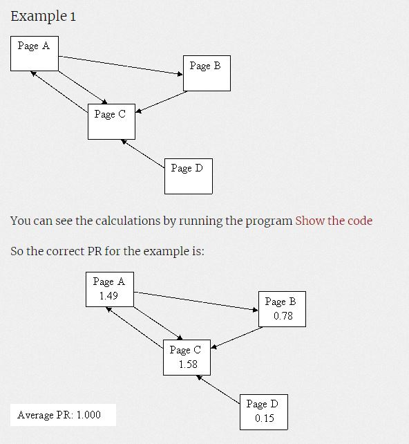
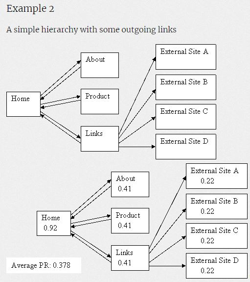
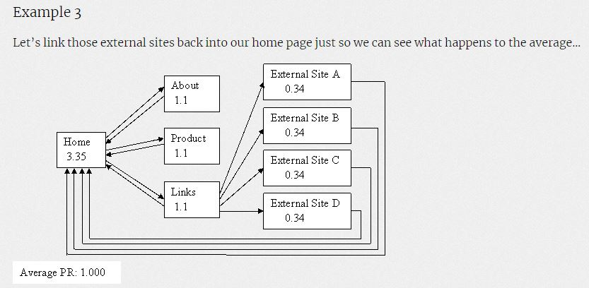
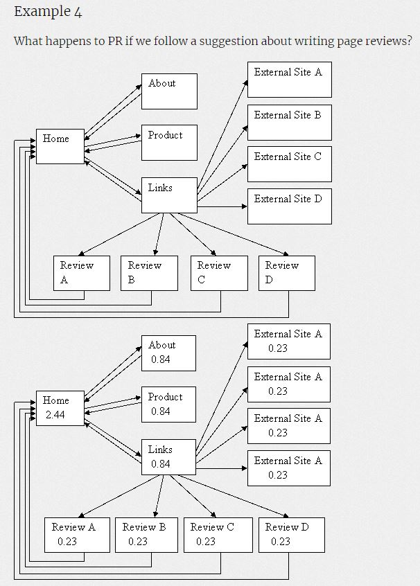

# PageRanking
A page ranking algorithm based on links to and from pages  
  
There are four examples in the code, named eg1, eg2, eg3, and eg4.  
They are the adjacency matrices for the networks in the images, by the same names.

## eg1

## eg2

## eg3

## eg4

All Images and examples are from this site: http://ianrogers.uk/google-page-rank/  
I do not own any of the images, nor did I create them.
